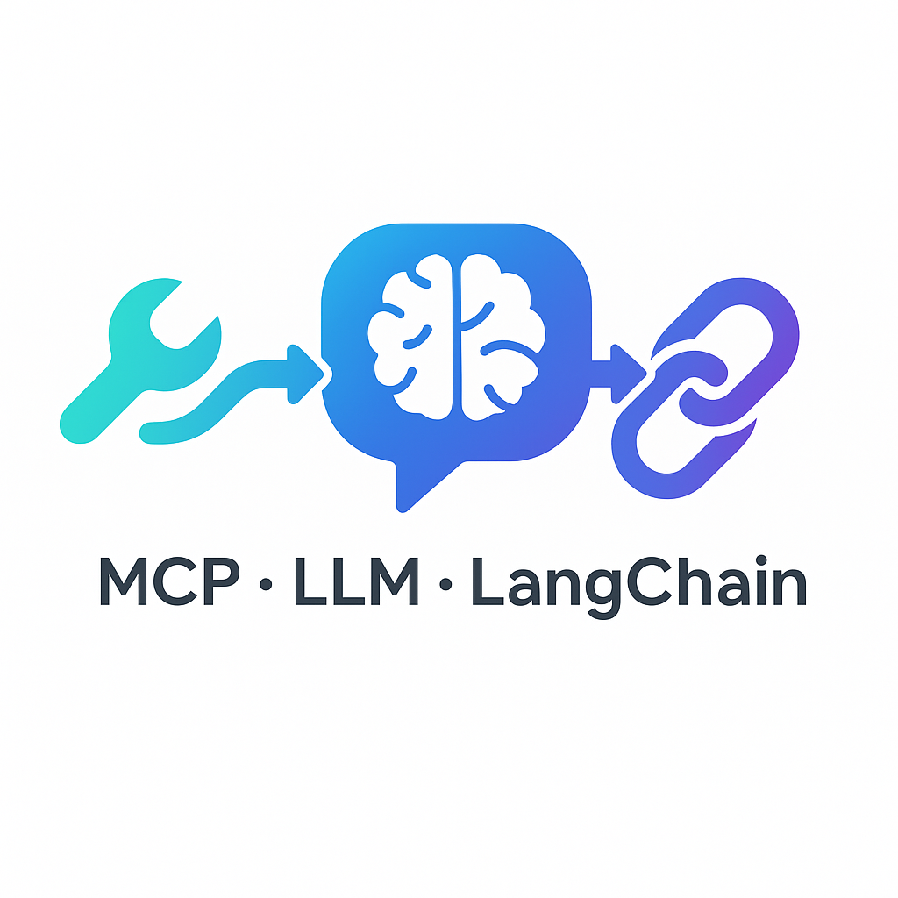

<p align="left">
  
</p>

# Module1 – MCP & Local LLM with Ollama + LangChain

> This module demonstrates how to use **MCP (Model Context Protocol)** to build agent-like workflows
> and how to run **local LLMs via Ollama** with LangChain, then integrate them for practical tasks.

---

## 📂 Project Overview
Module1 is divided into **three parts**:

### Part 1 – MCP: Agent-like Workflow
Build workflows where an LLM can call external tools via the **MCP protocol**.

**Tasks**
- **Task 1.1:** MCP + Claude for Browser Automation  
  - Follow the configuration in `mcp_example.json`
  - Use the following MCP tools:  
    - `raveSearch` – web search  
    - `GitHub` – fetch repo content  
    - `Puppeteer` – browser automation  
    - `Filesystem` – save / read local files  
    - `SequentialThinking` – reasoning support  
    - `Notion` – record and manage results
- **Advanced Task:**  
  Use **Claude + Puppeteer** to automatically:
  1. Visit a web page  
  2. Scrape a table  
  3. Save the scraped data locally via `Filesystem`  
  4. Record and organize the data into a **Notion** database  
  5. Auto-generate documentation as part of a project-management workflow.

---

### Part 2 – Playing with Ollama
Experiment with running and calling local models.

**Tasks**
- **Task 2.1:** Install Ollama and run local LLMs (e.g., `llama3`, `mistral`, `qwen2.5`)
- **Task 2.2:** Use the local Ollama runtime to call **OpenAI-compatible APIs**

---

### Part 3 – Integrating LangChain with Ollama
Combine local LLMs with LangChain to build simple agents and web demos.

**Tasks**
- **Task 3.1:** Reproduce the lecture’s LCEL (LangChain Expression Language) practice
- **Advanced:**  
  Integrate **Ollama + LangChain** into a **Gradio Web UI**,  
  enabling:
  - Proxy-style AI-Agent interface  
  - Simple front-end translation demo  
  - Usable showcase of your integrated pipeline

---

## 🏗️ Project Structure
Module1/
├─ mcp/ # MCP server configs and demo tools
│ ├─ mcp_example.json
│ └─ puppeteer_task.py
├─ ollama_demo/ # Basic Ollama usage and API call examples
│ └─ test_ollama.py
├─ langchain_demo/ # LangChain + Ollama agent examples
│ ├─ lcel_example.py
│ └─ gradio_ui.py # Optional UI demo
├─ requirements.txt
└─ README.md

yaml
Copy code

---

## ⚙️ Installation & Setup

### 1. Install Ollama
Follow [Ollama docs](https://ollama.ai) to install, then pull a model:
```bash
ollama pull llama3
2. Create Python Environment
bash
Copy code
pip install -r requirements.txt
3. (Optional) Configure MCP
Edit mcp/mcp_example.json to set up tools and API keys (e.g., for Notion).

🚀 Usage Examples
Run MCP + Claude Automation
bash
Copy code
python mcp/puppeteer_task.py --url "https://example.com"
Test Local Ollama
bash
Copy code
ollama run llama3 "Hello from local model!"
Run LangChain + Ollama Example
bash
Copy code
python langchain_demo/lcel_example.py
Launch Gradio Demo (Advanced)
bash
Copy code
python langchain_demo/gradio_ui.py
Open your browser at http://127.0.0.1:7860 to test the agent interface.

📈 Key Learnings
MCP provides a standard way to expose external tools (browsers, files, Notion) to LLM agents.

Ollama enables fast and private local inference with OpenAI-style API compatibility.

LangChain simplifies chaining prompts, tools, and agents.

Gradio UI makes demos interactive and shareable.

📦 Next Steps
Add RAG over local files as a tool via MCP.

Benchmark local vs. remote models for speed and quality.

Extend Gradio UI into a more robust multi-agent interface.
